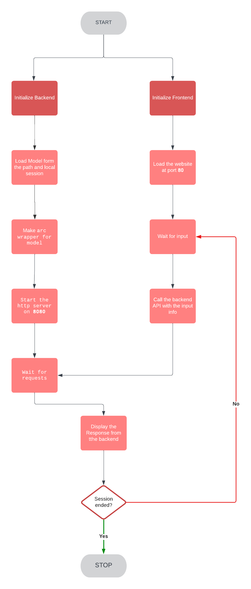

# Rust-LLAMA-Chat


A fullstack chat app built with Rust. This uses a local LLM (LLAMA) to create a chat application. No need to pay Open AI, just use a local model :D

Note from Akhil - I'll cover this in a video or a course.



## How to run

#### 1. Install huggingface-cli

```sh
$ make install-huggingface-cli
```

#### 2. Export huggingface token

Create a huggingface token: https://huggingface.co/settings/tokens

, then set the token as env variable on your machine:

```sh
$ export HF_TOKEN=<your-token-here>
```

#### 3. Download the [Llama-2-7B-Chat-GGML](https://huggingface.co/TheBloke/Llama-2-7B-Chat-GGML) model

```sh
$ make download-model
```

#### 4. Run the chat app

```sh
$ make rust-llama-chat
```

**PS!** If you're having issues connecting to the `backend`, try running `make rust-llama-chat-host` instead.

In your browser, open http://localhost:80

**Enjoy!**


